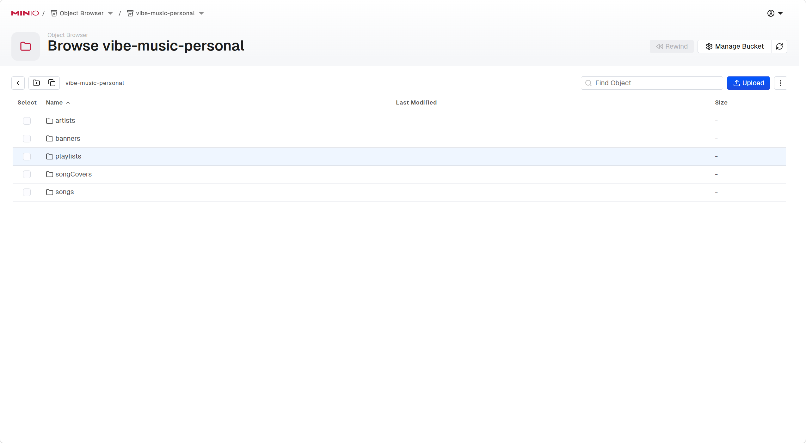
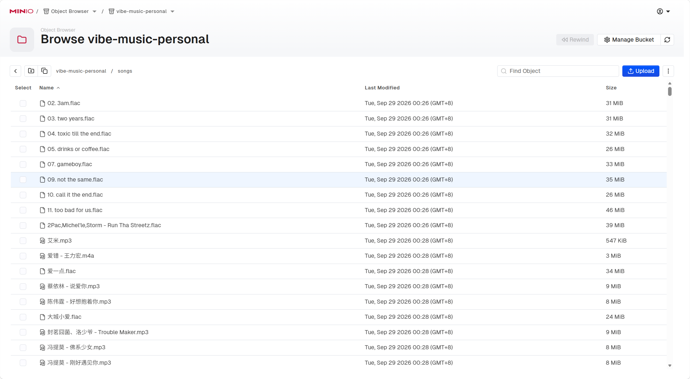

# JOJO MUSIC Server 🎶

## 项目简介

**JOJO MUSIC Server** 是 JOJO MUSIC 的后端服务，负责提供音乐数据、用户认证、内容管理、文件存储、缓存与 API 逻辑支持。

本项目基于 **Spring Boot 3 + Java 17 + Maven + MyBatis-Plus** 构建，并结合 **MySQL、Redis、MinIO、JWT** 等组件，为前端客户端和管理后台提供稳定的业务接口。

## 主要功能

- 用户认证与权限控制
- 歌手、歌曲、歌单、轮播图管理
- 评论、收藏、反馈处理
- 文件上传与静态资源存储（MinIO）
- Redis 缓存与热点数据优化
- 邮件验证码等扩展能力

## 技术栈

- Spring Boot 3
- Java 17
- Maven
- MySQL 8+
- Redis
- MinIO
- MyBatis-Plus
- JWT
- Druid

## 系统要求

- JDK 17+
- Maven 3.6+
- MySQL 8.0+
- Redis 6.0+
- MinIO

## 仓库地址

- GitHub: https://github.com/timi669/jojo-music-server
- Client: https://github.com/timi669/jojo-music-client
- Admin: https://github.com/timi669/jojo-music-admin

## 环境准备

1. 安装并启动 MySQL
2. 安装并启动 Redis
3. 安装并启动 MinIO
4. 创建数据库（示例）

   ```sql
   CREATE DATABASE vibe_music CHARACTER SET utf8mb4 COLLATE utf8mb4_unicode_ci;
   ```

5. 修改 `src/main/resources/application.yml` 中的数据库、Redis、MinIO 和邮件配置

## 构建与运行

1. 构建项目

   ```bash
   mvn clean package -DskipTests
   ```

2. 运行服务

   ```bash
   java -jar target/jojo-music-server-0.0.1-SNAPSHOT.jar
   ```

3. 如需本地调试，可使用

   ```bash
   mvn spring-boot:run
   ```

## 项目脚本

- `mvn clean`：清理构建产物
- `mvn compile`：编译项目
- `mvn test`：运行测试
- `mvn package`：打包可执行 JAR
- `mvn spring-boot:run`：启动 Spring Boot 应用

## 数据资源示例




## 依赖服务说明

本项目运行依赖以下服务：

- MySQL：持久化数据
- Redis：缓存和会话相关能力
- MinIO：音乐文件、图片等静态资源存储

## 版权与免责声明

本项目仅供学习、研究和个人技术实践使用。

- 请勿用于任何违法、侵权或商业用途
- 数据来源、文件授权和部署环境必须由使用者自行确认合法合规
- 因使用本项目造成的任何后果，由使用者自行承担

## 许可证

本项目遵循 MIT 许可证，详情请查看 [LICENSE](LICENSE)。

## 贡献

欢迎提交 Issue、Pull Request 或改进建议，帮助完善 JOJO MUSIC Server。